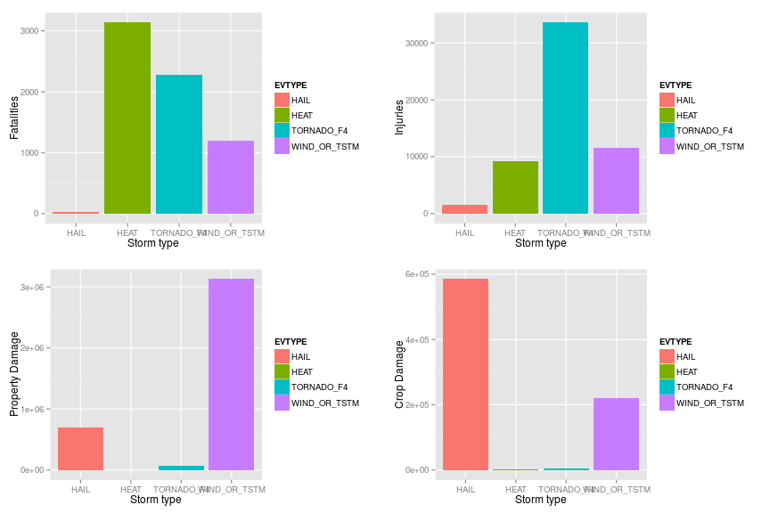

## Synopsis 

With global scientific consensus corroborating the direct
causal relationship between mankind's consumption of fossil fuels and
global climate change, it is increasingly important that government
agencies be aware of the variety and scale of these events so that
contingency and budgetary plans can be constructed to most effectively
handle these events when they occur.  In addition to planning for
future events, it is important that historical data be preserved for
use in categorizing and comparing new storm events to events measured
during times of lower $CO_2$ concentrations.

In this analysis, I investigated ways to assess which weather related
events, as provided by the U.S. National Oceanic and Atmospheric
Administration's (NOAA) storm database between the years of 1950 and
2011, provide the most harm to both Human life and to the economy
based on two key economic metrics. I performed some complex filtering
which allowed me to identify the top two types of disasters that
affect human life accross the the statistics of average fatalities and
injuries as well as economic health in terms of average property and crop
damage. The assumptions for this analysis were built up on the
analysis that Earth's significant meteorological and geological events
of the last 60 years were can represent the long term average for the
foreseeable future.

## Set up

In order to assist with the analysis of a large data set, I have
created two data sets : one represents the full NOAA set of
data, and the other contains a smaller subset of the full set of
data. In order select one data set or the other a "symbolic link" is
setup from the file "stormdata.csv" to point to the data set in
question. 

This approach makes it much easier to regenerate this document for the
full set of data after spending time working and debugging the
analysis while working on the much smaller set of data.  The
metaphorical "switch" can be flipped by just removing the file
"stormdata.csv" and then re-linking it to the large CSV file.

---

## Data Processing

### R Libraries used for this analysis

```r
library(dplyr)
library(ggplot2)
library(lubridate)
library(gridExtra)
```

### Reading in the datasets

As mentioned in the Set up Section, the NOAA database was saved to the
file stormdata.csv. I began my analysis by reading this file in.


```r
dat <- read.csv("./stormdata.csv")
ddat <- tbl_df( dat )
```


### Defining capture statistics

In order to keep a modular design to this project, I realized at first
that I wasn't sure of the statistics I wanted to keep as I built up my dataset.
Hence I used a generic function "capture_stats", that would be used to 
extract the relevant statistics from each captured sub grouping of the 
over all weather data. This function could easily extended to extract new statistics 
from the original stormdata.csv data set.


```r
capture_stats <- function() {
    setNames(list(~sum(FATALITIES,rm.na=TRUE),
                  ~sum(INJURIES,rm.na=TRUE),
                  ~sum(PROPDMG,rm.na=TRUE),
                  ~sum(CROPDMG,rm.na=TRUE),
                  ~n()
                  ),
             c("tot_fatalities","tot_injuries","tot_propdmg","tot_cropdmg","nevents")
             )  
}
```

### Filtering of the dataset 

I needed to get my data into a format that avoided redundancy and
over counting. I decided to group the types of weather related disasters
according to the following rules.

* Tornadoes according to the Fujita scale (F-scale) 0,1,2,3,4,5
* Hurricanes that do not involve tornadoes or hail
* Hail of any type that do not include tornadoes
* Thunderstorm / High Wind related but no tornadoes, hurricanes or hail related
* Cold without snow and ice related injuries and deaths
* Heat (without dust)
* Flood 
* Ice and Snow but discounting cold related effects
* Volcanoes
* Dust without heat 

The process for creating the filters was performed in an iterative
way so as to ensure that data wasn't counted twice to a given
category. The first few data types were easier such as tornadoes and hurricanes
as the selection of these events amounted to filtering for these
categories. As I continued with this analysis of these events, it
became difficult to filter out events that were already counted. For
instance, when drilling down into a more selective category like hail, it was
important to perform appropriate filters that would select out
categories that were already counted: namely the categories tornadoes and
hurricanes would be over counted unless appropriate filters were used
to remove the intersection of hail and tornadoes events as well as the intersection
of hail and hurricane events.

#### Design of the filters.

Filters were design in a bottom up format whereby new filters were
designed by creating a filter and iteratively verifying that it's
selection of events did not intersect with any previously created
filter. This trial and error process , while complex, did ensure that
events were not doubly counted.


```r
tornado_filter <- ~!is.na(F)
hurricane_filter <- ~grepl(".*hur[r]?i.*", EVTYPE,perl=T,ignore.case=T )
hail_filter <- ~grepl(".*hail.*", EVTYPE,perl=T,ignore.case=T) & !grepl(".*tornado.*",  EVTYPE,perl=T,ignore.case=T)
wind_tstorm_filter <- ~grepl(".*(wind|thunder|tstm).*", EVTYPE,perl=T,ignore.case=T) &
    !grepl(".*tornado.*",  EVTYPE,perl=T,ignore.case=T) & 
    !grepl(".*hurricane.*",  EVTYPE,perl=T,ignore.case=T) &
    !grepl(".*(cold|chill).*",  EVTYPE,perl=T,ignore.case=T) &
    !grepl(".*(flood).*",  EVTYPE,perl=T,ignore.case=T)

cold_noicesnow_filter <- ~grepl(".*(cold|chill).*", EVTYPE,perl=T,ignore.case=T) &
    !grepl(".*(flood).*",  EVTYPE,perl=T,ignore.case=T) &
    !grepl(".*(snow|ice).*", EVTYPE,perl=T,ignore.case=T)

icesnow_filter <- ~grepl(".*(ice|snow).*", EVTYPE,perl=T,ignore.case=T) & 
  !grepl(".*(flood).*",  EVTYPE,perl=T,ignore.case=T) &
	!grepl(".*(chill|snow).*",EVTYPE,perl=T,ignore.case=T) &
	!grepl(".*(wind).*",EVTYPE,perl=T,ignore.case=T)

head_filter <- ~grepl(".*(heat).*", EVTYPE,perl=T,ignore.case=T)

flood_filter <- ~grepl(".*(flood).*", EVTYPE,perl=T,ignore.case=T) &
    !grepl(".*(thunder|tstm).*",  EVTYPE,perl=T,ignore.case=T) & 
    !grepl(".*(wind).*",  EVTYPE,perl=T,ignore.case=T) & 
    !grepl(".*(snow).*",  EVTYPE,perl=T,ignore.case=T) 

volcano_filter <- ~grepl(".*volc.*", EVTYPE,perl=T,ignore.case=T)

dust_filter <- ~grepl(".*dust.*", EVTYPE,perl=T,ignore.case=T) &
    !grepl(".*(wind).*",EVTYPE,perl=T,ignore.case=T)
```

---
### Example Sub-tables created by filters
#### Tornadoes


```r
tornadoes <- ddat %>%
    filter_( .dots=tornado_filter ) %>%
    group_by(F) %>%
    mutate( EVTYPE=ifelse(!is.na(F),paste("TORNADO_F",as.character(F),sep=""),"BLAH"))  %>%
    group_by( EVTYPE ) %>% 
    summarise_( .dots=capture_stats() )
```

#### Example of Tornadoe Human and Property Damage

|EVTYPE     | tot_fatalities| tot_injuries| tot_propdmg| tot_cropdmg| nevents|
|:----------|--------------:|------------:|-----------:|-----------:|-------:|
|TORNADO_F0 |             23|          769|   326651.54|    12906.48|   24993|
|TORNADO_F1 |            220|         6908|  1412062.69|    33081.15|   19475|
|TORNADO_F2 |            575|        15146|  1035809.39|    35208.00|    9878|
|TORNADO_F3 |           1258|        22510|   318753.59|    13165.69|    3179|
|TORNADO_F4 |           2274|        33617|    74075.12|     3986.00|    1072|
|TORNADO_F5 |           1285|        12293|    10405.14|     1678.20|     137|


### Hurricanes


```r
hurricane <- ddat %>%
    filter_( .dots=hurricane_filter ) %>%
    mutate( EVTYPE="HURRICANE") %>%
    group_by(EVTYPE) %>%
    summarise_( .dots=capture_stats() )
```

### Hail only effects


```r
hail <- ddat %>%
    filter_( .dots=hail_filter ) %>%
    mutate( EVTYPE="HAIL") %>%
    group_by(EVTYPE) %>%
    summarise_( .dots=capture_stats() )
```

### Thunderstorm and Wind


```r
wind_tstorm <- ddat %>%
    filter_( .dots=wind_tstorm_filter ) %>%
    mutate( EVTYPE="WIND_OR_TSTM") %>%
    group_by(EVTYPE) %>%
    summarise_( .dots=capture_stats() )
```

### Cold Without Snow or Ice


```r
cold_noicesnow <- ddat %>%
    filter_( .dots=cold_noicesnow_filter ) %>%
    mutate( EVTYPE="COLD") %>%
    group_by(EVTYPE) %>%
    summarise_( .dots=capture_stats() )
```

### Heat 


```r
heat <- ddat %>%
    filter_( .dots=head_filter ) %>%
    mutate( EVTYPE="HEAT") %>%
    group_by(EVTYPE) %>%
    summarise_( .dots=capture_stats() )
```

### Flood


```r
flood <- ddat %>%
    filter_( .dots=flood_filter ) %>%
    mutate( EVTYPE="FLOOD") %>%
    group_by(EVTYPE) %>%
    summarise_( .dots=capture_stats() )
```

### Ice and Snow without wind effects


```r
icesnow <- ddat %>%
    filter_( .dots=icesnow_filter ) %>%
    mutate( EVTYPE="ICE_SNOW") %>%
    group_by(EVTYPE) %>%
    summarise_( .dots=capture_stats() )
```

### Volcano related 


```r
volcano <- ddat %>%
    filter_( .dots=volcano_filter ) %>% 
    mutate( EVTYPE="VOLCANO") %>%
    group_by(EVTYPE) %>%
    summarise_( .dots=capture_stats() )
```

### Dust related


```r
dust <- ddat %>%
    filter_( .dots=dust_filter ) %>% 
    mutate( EVTYPE="DUST") %>%
    group_by(EVTYPE) %>%
    summarise_( .dots=capture_stats() )
```

### Combined table

After each factor is isolated, I combine each of these sub-tables into
a master table to consolidate results and make it easier to work on
the aggregate levels.


```r
all_data <- Reduce( function(x,y){ merge(x,y,all=T) }, 
            list(tornadoes, hurricane, 
                 hail, wind_tstorm, 
                 cold_noicesnow, heat, 
                 flood, icesnow, 
                 volcano, dust ) )
```

|EVTYPE       | tot_fatalities| tot_injuries| tot_propdmg| tot_cropdmg| nevents|
|:------------|--------------:|------------:|-----------:|-----------:|-------:|
|HEAT         |           3139|         9225|     3233.86|     1474.18|    2648|
|TORNADO_F4   |           2274|        33617|    74075.12|     3986.00|    1072|
|FLOOD        |           1526|         8605|  2435545.60|   364344.93|   82707|
|TORNADO_F5   |           1285|        12293|    10405.14|     1678.20|     137|
|TORNADO_F3   |           1258|        22510|   318753.59|    13165.69|    3179|
|WIND_OR_TSTM |           1189|        11495|  3130539.90|   221166.74|  363169|
|TORNADO_F2   |            575|        15146|  1035809.39|    35208.00|    9878|
|COLD         |            454|          326|    14927.09|     8952.79|    2713|
|TORNADO_F1   |            220|         6908|  1412062.69|    33081.15|   19475|
|HURRICANE    |            136|         1329|    23758.25|    10813.79|     288|
|ICE_SNOW     |             98|         2153|    74283.47|     1690.75|    2101|
|DUST         |             25|          484|     5789.63|     1602.50|     587|
|TORNADO_F0   |             23|          769|   326651.54|    12906.48|   24993|
|HAIL         |             21|         1468|   699319.78|   585955.16|  290400|
|VOLCANO      |              1|            1|      501.00|        1.00|      29|

## Results

To fully analyze this data set I decided to only take the top weather
related disasters that were considered leaders of the statistics
fatalities, injuries, property and crop damage.


|EVTYPE       | tot_fatalities| tot_injuries| tot_propdmg| tot_cropdmg| nevents|     expfatal|
|:------------|--------------:|------------:|-----------:|-----------:|-------:|------------:|
|WIND_OR_TSTM |           1189|        11495|  3130539.90|   221166.74|  363169| 7.196799e+06|
|FLOOD        |           1526|         8605|  2435545.60|   364344.93|   82707| 2.103515e+06|
|HEAT         |           3139|         9225|     3233.86|     1474.18|    2648| 1.385345e+05|
|HAIL         |             21|         1468|   699319.78|   585955.16|  290400| 1.016400e+05|
|TORNADO_F2   |            575|        15146|  1035809.39|    35208.00|    9878| 9.466417e+04|
|TORNADO_F1   |            220|         6908|  1412062.69|    33081.15|   19475| 7.140833e+04|
|TORNADO_F3   |           1258|        22510|   318753.59|    13165.69|    3179| 6.665303e+04|
|TORNADO_F4   |           2274|        33617|    74075.12|     3986.00|    1072| 4.062880e+04|
|COLD         |            454|          326|    14927.09|     8952.79|    2713| 2.052837e+04|
|TORNADO_F0   |             23|          769|   326651.54|    12906.48|   24993| 9.580650e+03|
|ICE_SNOW     |             98|         2153|    74283.47|     1690.75|    2101| 3.431633e+03|
|TORNADO_F5   |           1285|        12293|    10405.14|     1678.20|     137| 2.934083e+03|
|HURRICANE    |            136|         1329|    23758.25|    10813.79|     288| 6.528000e+02|
|DUST         |             25|          484|     5789.63|     1602.50|     587| 2.445833e+02|
|VOLCANO      |              1|            1|      501.00|        1.00|      29| 4.833333e-01|

<!-- asdpp  -->

```r
topinjure  <- all_data %>% top_n(1, wt=tot_injuries )
topdmg     <- all_data %>% top_n(1, wt=tot_propdmg )
topcrop    <- all_data %>% top_n(1, wt=tot_cropdmg )
topfatal   <- all_data %>% top_n(1, wt=tot_fatalities)
all_top <- tbl_df(all_data[all_data$EVTYPE %in% c(topinjure,topdmg,topcrop,topfatal),])
knitr::kable( all_top )
```


|EVTYPE       | tot_fatalities| tot_injuries| tot_propdmg| tot_cropdmg| nevents|
|:------------|--------------:|------------:|-----------:|-----------:|-------:|
|HAIL         |             21|         1468|   699319.78|   585955.16|  290400|
|HEAT         |           3139|         9225|     3233.86|     1474.18|    2648|
|TORNADO_F4   |           2274|        33617|    74075.12|     3986.00|    1072|
|WIND_OR_TSTM |           1189|        11495|  3130539.90|   221166.74|  363169|

A final plot of the data

```r
p1 <- ggplot( all_top, aes(x=EVTYPE,y=tot_fatalities,fill=EVTYPE)) +
              labs(x="Storm type", y="Fatalities") +
              geom_bar(stat="identity",position='dodge') 
p2 <- ggplot( all_top,aes(x=EVTYPE,y=tot_injuries,fill=EVTYPE)) + 
              labs(x="Storm type",y="Injuries") + 
              geom_bar(stat="identity",position='dodge') 
p3 <-ggplot( all_top, aes(x=EVTYPE,y=tot_propdmg,fill=EVTYPE)) +
             labs(x="Storm type", y="Property Damage") +
             geom_bar(stat="identity",position='dodge') 
p4 <- ggplot( all_top,aes(x=EVTYPE,y=tot_cropdmg,fill=EVTYPE)) + 
              labs(x="Storm type",y="Crop Damage") + 
              geom_bar(stat="identity",position='dodge')
grid.arrange(p1,p2,p3,p4,ncol=2)
```

 


